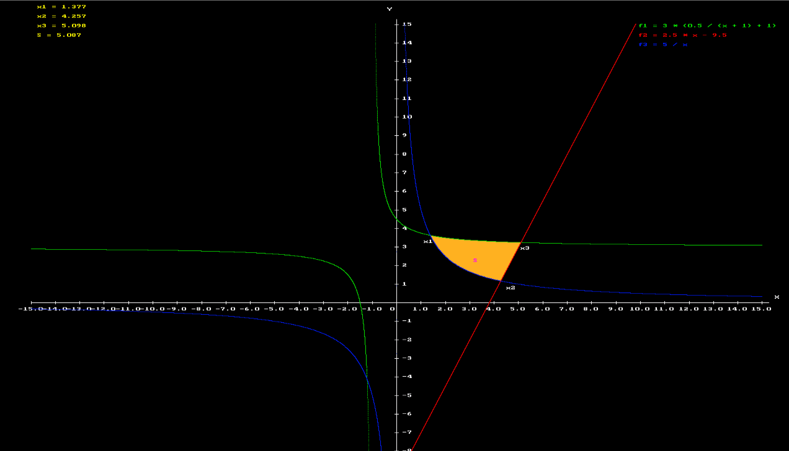

# Graph Project

In this project we are drawing three given functions and denoting their intersection.

The functions are
$$
\begin{aligned}
\dot{x} & = 3(\dfrac{1}{2(x+1)}+1) \\
\dot{y} & =  2.5x-9.5  \\
\dot{z} & = \dfrac{5}{x} 
\end{aligned}
$$

$$f_1 = 3(\dfrac{1}{2(x+1)+1}) 
f_2 = 2.5x-9.5 
f_3 = \dfrac{5}{x} $$

The result can be seen below

